# Stride — Technical Documentation

> **Version:** 1.1.0  
> **Date:** February 10, 2026  
> **Classification:** Internal — Engineering  
> **Status:** Approved for MVP Development

---

## Table of Contents

1. [Executive Summary](#1-executive-summary)
2. [System Architecture Overview](#2-system-architecture-overview)
3. [Architecture Requirements](#3-architecture-requirements)
4. [High-Level System Architecture](#4-high-level-system-architecture)
5. [Backend Architecture](#5-backend-architecture)
6. [Frontend Architecture](#6-frontend-architecture)
7. [Adaptive AI Service — Deep Dive](#7-adaptive-ai-service--deep-dive)
8. [Database Design](#8-database-design)
9. [Authentication & Authorization](#9-authentication--authorization)
10. [Gamification Engine](#10-gamification-engine)
11. [Real-Time Communication](#11-real-time-communication)
12. [Caching Strategy](#12-caching-strategy)
13. [Search Infrastructure](#13-search-infrastructure)
14. [File Storage](#14-file-storage)
15. [API Design](#15-api-design)
16. [CI/CD Pipeline](#16-cicd-pipeline)
17. [Infrastructure & Deployment](#17-infrastructure--deployment)
18. [Security Architecture](#18-security-architecture)
19. [Performance & Scalability](#19-performance--scalability)
20. [Testing Strategy](#20-testing-strategy)
21. [Internationalization (i18n)](#21-internationalization-i18n)
22. [Phased Delivery Roadmap](#22-phased-delivery-roadmap)
23. [Appendix — Technology Matrix](#23-appendix--technology-matrix)
24. [Appendix — Glossary](#24-appendix--glossary)

---

## 1. Executive Summary

**Stride** is a Ukrainian-first, all-ages gamified educational platform powered by a proprietary Adaptive AI Service. The system dynamically generates educational tasks and calibrates difficulty in real time based on individual student performance, streaks, and learning state.

**Core Differentiator:** No existing Ukrainian EdTech platform combines gamification with AI-powered adaptive learning. Stride fills this gap.

| Attribute        | Detail                                                  |
|------------------|---------------------------------------------------------|
| Platform Type    | B2C / B2B EdTech SaaS                                   |
| Target Market    | Ukraine (primary), global (future)                      |
| Target Audience  | All ages — K-12, university, lifelong                   |
| MVP Subjects     | Mathematics, Ukrainian Language, History of Ukraine, English |
| Architecture     | Layered Monolith (Controller → Service → Repository)    |
| Stack            | .NET 10 · Angular 20 · PostgreSQL 17+ · MongoDB         |
| AI Backend       | Google Gemini API (factory-based, extensible)            |
| Delivery         | PWA (mobile-first), responsive                          |

---

## 2. System Architecture Overview

### 2.1 Architecture Style

Stride adopts a **Layered Monolith** architecture with a straightforward **Controller → Service → Repository** pattern. This provides maximum development velocity for the MVP while keeping the codebase clean and testable. Each logical domain (Learning, Gamification, AI, etc.) is organized into its own namespace with clear service boundaries.

### 2.2 High-Level System Diagram

```mermaid
graph TB
    subgraph Client Layer
        PWA[Angular 20 PWA<br/>Mobile-First]
        PUSH[Push Notification<br/>Service Worker]
    end

    subgraph API Gateway / Reverse Proxy
        NGINX[NGINX<br/>Reverse Proxy]
    end

    subgraph Application Layer — .NET 10
        API[ASP.NET Core<br/>Web API]
        SIGNALR[SignalR Hub<br/>Real-Time]

        subgraph Services
            AUTH_SVC[Auth<br/>Service]
            LEARN_SVC[Learning<br/>Service]
            GAMIF_SVC[Gamification<br/>Service]
            AI_SVC[Adaptive AI<br/>Service]
            ADMIN_SVC[Admin<br/>Service]
            CONTENT_SVC[Content<br/>Service]
        end
    end

    subgraph Data Layer
        PG[(PostgreSQL 17+<br/>Relational Data)]
        MONGO[(MongoDB<br/>Document Store)]
        VALKEY[(Valkey<br/>Cache)]
        MINIO[(MinIO<br/>Object Storage)]
        MEILI[(Meilisearch<br/>Full-Text Search)]
    end

    subgraph AI Layer
        AI_FACTORY[AI Provider Factory]
        GEMINI[Google Gemini API<br/>Primary]
        FUTURE_AI[Future Providers<br/>GPT / Claude / etc.]
    end

    PWA -->|HTTPS| NGINX
    PUSH -.->|Web Push| PWA
    NGINX --> API
    NGINX --> SIGNALR
    API --> AUTH_SVC
    API --> LEARN_SVC
    API --> GAMIF_SVC
    API --> AI_SVC
    API --> ADMIN_SVC
    API --> CONTENT_SVC
    AUTH_SVC --> PG
    LEARN_SVC --> PG
    GAMIF_SVC --> PG
    GAMIF_SVC --> VALKEY
    AI_SVC --> PG
    AI_SVC --> MONGO
    AI_SVC --> VALKEY
    AI_SVC --> AI_FACTORY
    AI_FACTORY --> GEMINI
    AI_FACTORY -.->|Future| FUTURE_AI
    CONTENT_SVC --> MINIO
    CONTENT_SVC --> MEILI
```

---

## 3. Architecture Requirements

### 3.1 Functional Requirements

| ID      | Requirement                                                                 | Priority |
|---------|-----------------------------------------------------------------------------|----------|
| FR-01   | AI-generated task delivery with real-time difficulty adaptation              | MUST     |
| FR-02   | Student performance model tracking (accuracy, time, streaks, mastery)       | MUST     |
| FR-03   | Gamification: XP, streaks, levels, badges, leaderboards                     | MUST     |
| FR-04   | Role-based access: Student, Teacher, Admin                                  | MUST     |
| FR-05   | Subject catalog aligned with Ukrainian curriculum (4 MVP subjects)          | MUST     |
| FR-06   | Teacher dashboard with class management and student analytics               | MUST     |
| FR-07   | Admin panel with content, user, and AI monitoring                           | MUST     |
| FR-08   | PWA with offline lesson caching and push notifications                      | MUST     |
| FR-09   | Full Ukrainian UI with i18n-ready architecture                              | MUST     |
| FR-10   | Real-time multiplayer quiz battles                                          | CAN      |
| FR-11   | AI Tutor chatbot with Socratic method                                       | CAN      |
| FR-12   | PDF/notes upload with AI-generated study materials                          | CAN      |

### 3.2 Non-Functional Requirements

| ID       | Category        | Requirement                                                      | Target          |
|----------|-----------------|------------------------------------------------------------------|-----------------|
| NFR-01   | Performance     | API response time (p95)                                          | ≤ 200 ms        |
| NFR-02   | Performance     | AI task generation latency (cached pool)                         | ≤ 50 ms         |
| NFR-03   | Performance     | AI task generation latency (API call)                            | ≤ 3 s           |
| NFR-04   | Availability    | System uptime                                                    | 99.5%           |
| NFR-05   | Scalability     | Concurrent users (MVP)                                           | 5,000           |
| NFR-06   | Scalability     | Concurrent users (Year 2)                                        | 50,000          |
| NFR-07   | Security        | OWASP Top 10 compliance                                          | Full            |
| NFR-08   | Security        | Data encryption at rest and in transit                            | AES-256 / TLS 1.3 |
| NFR-09   | Data Residency  | All student PII stored within EU/Ukraine                          | Mandatory       |
| NFR-10   | Accessibility   | WCAG 2.1 AA compliance                                          | Target          |
| NFR-11   | Offline         | Cached lessons available without network                          | Core lessons    |
| NFR-12   | Localization    | Primary (Ukrainian), extensible to additional languages           | MVP: uk-UA      |
| NFR-13   | Deployment      | Zero-downtime deployments                                        | Rolling update  |
| NFR-14   | Recovery        | Recovery Point Objective (RPO)                                   | ≤ 1 hour        |
| NFR-15   | Recovery        | Recovery Time Objective (RTO)                                    | ≤ 30 min        |

### 3.3 Architecture Constraints

| Constraint                              | Rationale                                              |
|-----------------------------------------|--------------------------------------------------------|
| Open-source / free tooling preferred    | Bootstrap budget; minimize licensing costs             |
| Gemini API for AI (factory-extensible)  | Best cost/quality ratio; factory pattern allows swapping providers |
| Layered architecture (not CQRS)         | Simplicity; Controller → Service → Repository          |
| PostgreSQL + MongoDB (dual DB)          | PG for relational data; Mongo for flexible documents (AI tasks, templates) |
| Docker Compose only for deployment      | Simple ops; no Kubernetes overhead for MVP/growth      |

---

## 4. High-Level System Architecture

### 4.1 Logical Architecture — Domain Areas

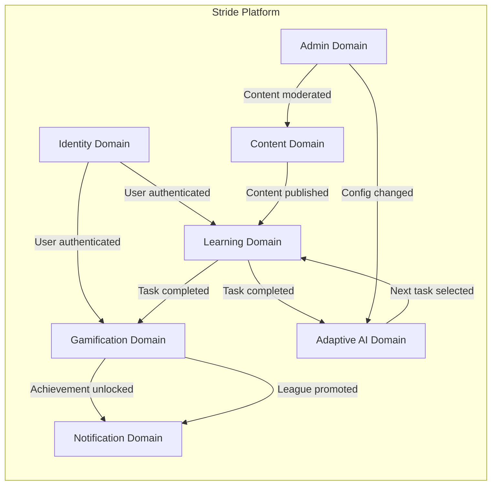

### 4.2 Request Flow — Controller → Service → Repository

All request handling follows a simple three-layer pattern. Services call each other directly via constructor injection when cross-domain communication is needed.

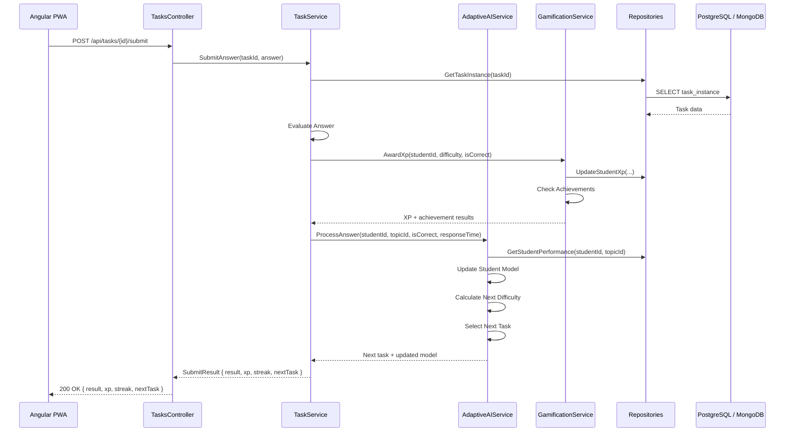

---

## 5. Backend Architecture

### 5.1 Layered Architecture

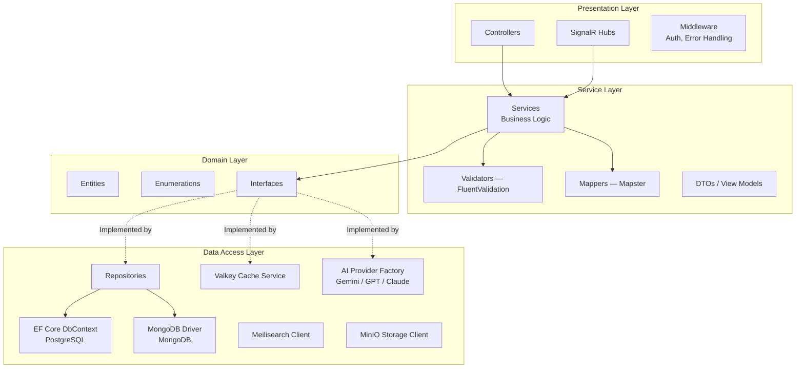

### 5.2 Project Structure

```
src/
├── Stride.Api/                          # ASP.NET Core host
│   ├── Controllers/
│   │   ├── AuthController.cs
│   │   ├── TasksController.cs
│   │   ├── SubjectsController.cs
│   │   ├── GamificationController.cs
│   │   ├── LeaderboardController.cs
│   │   ├── ClassesController.cs
│   │   └── AdminController.cs
│   ├── Hubs/
│   │   ├── LeaderboardHub.cs
│   │   └── NotificationHub.cs
│   ├── Middleware/
│   │   └── GlobalExceptionMiddleware.cs
│   ├── Filters/
│   └── Program.cs
│
├── Stride.Core/                         # Domain entities and interfaces
│   ├── Entities/
│   │   ├── User.cs
│   │   ├── StudentProfile.cs
│   │   ├── TeacherProfile.cs
│   │   ├── Subject.cs
│   │   ├── Topic.cs
│   │   ├── TaskTemplate.cs
│   │   ├── TaskInstance.cs
│   │   ├── TaskAttempt.cs
│   │   ├── StudentPerformance.cs
│   │   ├── Achievement.cs
│   │   ├── LeaderboardEntry.cs
│   │   ├── Class.cs
│   │   └── ClassAssignment.cs
│   ├── Enums/
│   │   ├── UserRole.cs
│   │   ├── TaskType.cs
│   │   ├── League.cs
│   │   └── StreakDirection.cs
│   ├── Interfaces/
│   │   ├── Repositories/
│   │   │   ├── IUserRepository.cs
│   │   │   ├── ITaskRepository.cs
│   │   │   ├── IStudentPerformanceRepository.cs
│   │   │   ├── IGamificationRepository.cs
│   │   │   └── IClassRepository.cs
│   │   ├── Services/
│   │   │   ├── IAIProviderFactory.cs
│   │   │   ├── IAIProvider.cs
│   │   │   ├── ICacheService.cs
│   │   │   └── IStorageService.cs
│   │   └── IUnitOfWork.cs
│   └── DTOs/
│       ├── Auth/
│       ├── Tasks/
│       ├── Gamification/
│       └── Admin/
│
├── Stride.Services/                     # Business logic layer
│   ├── AuthService.cs
│   ├── TaskService.cs
│   ├── LearningService.cs
│   ├── AdaptiveAIService.cs
│   ├── GamificationService.cs
│   ├── LeaderboardService.cs
│   ├── ClassService.cs
│   ├── AdminService.cs
│   ├── ContentService.cs
│   └── Validators/
│       ├── SubmitAnswerValidator.cs
│       ├── RegisterValidator.cs
│       └── CreateClassValidator.cs
│
├── Stride.DataAccess/                   # Data access layer
│   ├── PostgreSQL/
│   │   ├── StrideDbContext.cs
│   │   ├── Configurations/              # EF Core Fluent API configs
│   │   ├── Repositories/
│   │   │   ├── UserRepository.cs
│   │   │   ├── TaskRepository.cs
│   │   │   ├── StudentPerformanceRepository.cs
│   │   │   ├── GamificationRepository.cs
│   │   │   └── ClassRepository.cs
│   │   └── Migrations/
│   ├── MongoDB/
│   │   ├── MongoDbContext.cs
│   │   ├── Collections/
│   │   │   ├── TaskTemplateCollection.cs
│   │   │   ├── TaskInstanceCollection.cs
│   │   │   └── AIGenerationLogCollection.cs
│   │   └── Repositories/
│   │       ├── TaskTemplateRepository.cs
│   │       └── TaskInstanceRepository.cs
│   ├── Caching/
│   │   └── ValkeyCacheService.cs
│   ├── AI/
│   │   ├── AIProviderFactory.cs
│   │   ├── GeminiProvider.cs
│   │   ├── IAIProvider.cs
│   │   └── Models/
│   │       ├── AIGenerationRequest.cs
│   │       └── AIGenerationResponse.cs
│   ├── Search/
│   │   └── MeilisearchService.cs
│   └── Storage/
│       └── MinIOStorageService.cs
│
└── tests/
    ├── Stride.Services.Tests/
    ├── Stride.DataAccess.Tests/
    └── Stride.Api.IntegrationTests/
```

### 5.3 Key Backend Patterns

| Pattern                     | Implementation                   | Purpose                                           |
|-----------------------------|----------------------------------|---------------------------------------------------|
| Layered Architecture        | Controller → Service → Repository| Clean separation of concerns                      |
| Repository                  | Generic + Specialized repos      | Abstract data access for both PG and MongoDB      |
| Factory Pattern             | `AIProviderFactory`              | Extensible AI provider selection (Gemini, GPT, Claude) |
| Strategy Pattern            | `IAIProvider` interface          | Swappable AI implementations behind common interface |
| Unit of Work                | EF Core `DbContext`              | Transactional consistency for PostgreSQL           |
| Result Pattern              | `Result<T>` / FluentResults      | Explicit error handling, no exceptions for flow    |
| Options Pattern             | `IOptions<T>`                    | Typed configuration                                |
| Dependency Injection        | Built-in .NET DI                 | All services registered via `Program.cs`           |
| Validation                  | FluentValidation                 | Input validation in service layer                  |

### 5.4 AI Provider Factory — Extensibility Design

The AI integration is built around an abstract factory that allows swapping or adding AI providers without modifying business logic.

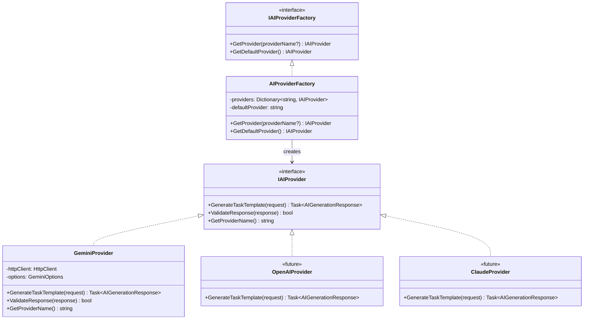

**Registration in DI:**

```
// Program.cs — AI Provider Registration
services.AddHttpClient<GeminiProvider>();
services.AddSingleton<IAIProvider, GeminiProvider>();
// Future: services.AddSingleton<IAIProvider, OpenAIProvider>();
// Future: services.AddSingleton<IAIProvider, ClaudeProvider>();
services.AddSingleton<IAIProviderFactory, AIProviderFactory>();
```

---

## 6. Frontend Architecture

### 6.1 Angular 20 PWA Architecture

```mermaid
graph TB
    subgraph Angular 20 PWA
        direction TB
        
        subgraph Shell
            APP[App Component]
            ROUTER[Router Module]
            LAYOUT[Layout — Header, Nav, Footer]
        end

        subgraph Feature Modules — Lazy Loaded
            DASH[Dashboard Module]
            LESSONS[Lessons Module]
            TASKS[Tasks Module]
            PROFILE[Profile Module]
            LEADER[Leaderboard Module]
            TEACHER[Teacher Module]
            ADMIN_FE[Admin Module]
        end

        subgraph Core
            AUTH_SVC_FE[Auth Service]
            API_SVC_FE[API Service — HttpClient]
            WS_SVC[WebSocket Service — SignalR]
            STORE[State Management<br/>Angular Signals]
            GUARD[Route Guards]
            INTERCEPT[HTTP Interceptors<br/>Auth, Error, Retry]
        end

        subgraph Shared
            UI_LIB[UI Component Library]
            PIPES[Custom Pipes]
            DIRECTIVES[Directives]
            I18N_SVC[i18n Service]
        end

        subgraph PWA Layer
            SW[Service Worker]
            CACHE_STR[Cache Strategy<br/>Lessons, Assets]
            PUSH_SVC[Push Notification Handler]
            OFFLINE[Offline Fallback UI]
        end
    end

    ROUTER --> DASH
    ROUTER --> LESSONS
    ROUTER --> TASKS
    ROUTER --> PROFILE
    ROUTER --> LEADER
    ROUTER --> TEACHER
    ROUTER --> ADMIN_FE
    DASH --> STORE
    LESSONS --> STORE
    TASKS --> STORE
    STORE --> API_SVC_FE
    STORE --> WS_SVC
    API_SVC_FE --> INTERCEPT
    SW --> CACHE_STR
    SW --> PUSH_SVC
```

### 6.2 Frontend Project Structure

```
stride-client/
├── src/
│   ├── app/
│   │   ├── core/                        # Singleton services, guards, interceptors
│   │   │   ├── auth/
│   │   │   ├── api/
│   │   │   ├── guards/
│   │   │   ├── interceptors/
│   │   │   └── state/                   # Global state (Angular Signals)
│   │   │
│   │   ├── shared/                      # Reusable components, pipes, directives
│   │   │   ├── components/
│   │   │   │   ├── task-card/
│   │   │   │   ├── xp-bar/
│   │   │   │   ├── streak-counter/
│   │   │   │   ├── badge-display/
│   │   │   │   └── leaderboard-row/
│   │   │   ├── pipes/
│   │   │   └── directives/
│   │   │
│   │   ├── features/                    # Lazy-loaded feature modules
│   │   │   ├── dashboard/
│   │   │   ├── lessons/
│   │   │   ├── tasks/
│   │   │   ├── profile/
│   │   │   ├── leaderboard/
│   │   │   ├── teacher/
│   │   │   └── admin/
│   │   │
│   │   ├── layout/                      # Shell layout components
│   │   └── app.routes.ts
│   │
│   ├── assets/
│   │   ├── i18n/                        # Translation JSON files
│   │   │   ├── uk.json
│   │   │   └── en.json
│   │   ├── icons/
│   │   └── images/
│   │
│   ├── environments/
│   ├── styles/                          # Global SCSS / Tailwind config
│   ├── manifest.webmanifest
│   └── ngsw-config.json                 # Angular Service Worker config
│
├── angular.json
├── tailwind.config.js
└── tsconfig.json
```

### 6.3 PWA Caching Strategy

| Resource Type          | Strategy                   | TTL / Policy                              |
|------------------------|----------------------------|-------------------------------------------|
| App Shell (HTML/JS/CSS)| Precache (build hash)      | Updated on new deployment                 |
| API — Lesson content   | StaleWhileRevalidate       | Cache first, refresh in background        |
| API — Task data        | NetworkFirst               | Always fresh; fallback to last cached     |
| API — Leaderboard      | NetworkOnly                | Real-time data, no caching                |
| Static assets / images | CacheFirst                 | 30-day TTL                                |
| i18n translation files | Precache                   | Updated on build                          |

---

## 7. Adaptive AI Service — Deep Dive

### 7.1 Architecture Overview

The Adaptive AI Service is Stride's core differentiator — a custom .NET 10 service that generates educational tasks, calibrates difficulty in real time, and maintains a per-student performance model. AI generation is powered by **Google Gemini API** via a **factory pattern** that allows future extension to other providers (OpenAI GPT, Anthropic Claude, etc.).

```mermaid
graph TB
    subgraph Adaptive AI Service
        direction TB
        
        subgraph Student Model Engine
            PM[Performance Model<br/>per Student per Topic]
            HIST[Historical Data<br/>Accuracy, Time, Streaks]
        end

        subgraph Difficulty Engine
            CALC[Difficulty Calculator<br/>Level 1–100]
            ZONE[Flow Zone Targeting<br/>70–80% Success Rate]
        end

        subgraph Task Pipeline
            POOL[Cached Task Pools<br/>per Difficulty Band<br/>Valkey]
            TPL[Parameterized Templates<br/>MongoDB]
            AI_GEN[AI Provider Factory]
            REVIEW[Human Review Queue]
            FALLBACK[Pre-Authored<br/>Task Bank]
        end
    end

    subgraph AI Providers — Factory Pattern
        FACTORY[AIProviderFactory]
        GEMINI_P[Gemini Provider<br/>Primary]
        GPT_P[GPT Provider<br/>Future]
        CLAUDE_P[Claude Provider<br/>Future]
    end

    PM --> CALC
    HIST --> CALC
    CALC --> ZONE
    ZONE -->|Target Difficulty| POOL
    POOL -->|Cache miss| TPL
    TPL -->|New template needed| AI_GEN
    AI_GEN --> FACTORY
    FACTORY --> GEMINI_P
    FACTORY -.->|Future| GPT_P
    FACTORY -.->|Future| CLAUDE_P
    AI_GEN --> REVIEW
    REVIEW -->|Approved| POOL
    POOL -->|Insufficient| FALLBACK
```

### 7.2 Student Performance Model

Each student maintains an independent performance vector **per topic**:

| Parameter                 | Type     | Description                                           |
|---------------------------|----------|-------------------------------------------------------|
| `currentDifficulty`       | float    | Current difficulty level (1.0 – 100.0)                |
| `rollingAccuracy`         | float    | Accuracy over last N tasks (configurable, default 20) |
| `currentStreak`           | int      | Consecutive correct/incorrect answers                 |
| `streakDirection`         | enum     | `Winning` / `Losing` / `Neutral`                     |
| `averageResponseTime`     | TimeSpan | Rolling average response time                         |
| `topicMastery`            | float    | Long-term mastery estimate (0.0 – 1.0)               |
| `totalTasksAttempted`     | int      | Lifetime tasks attempted in this topic                |
| `lastActiveAt`            | DateTime | Timestamp of last activity                            |
| `sessionCount`            | int      | Total learning sessions                               |
| `difficultyHistory`       | float[]  | Recent difficulty levels (ring buffer, last 50)       |

### 7.3 Difficulty Algorithm

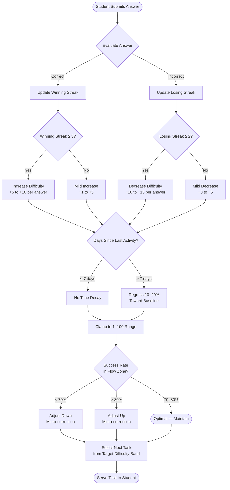

### 7.4 Difficulty Formula (Pseudocode)

```
function CalculateNextDifficulty(model: StudentPerformanceModel): float

    // 1. Base adjustment from streak
    let adjustment = 0
    if model.streakDirection == Winning AND model.currentStreak >= 3:
        adjustment = +5 + (model.currentStreak - 3) * 2    // accelerating increase
        adjustment = min(adjustment, 10)                     // cap per step
    elif model.streakDirection == Losing AND model.currentStreak >= 2:
        adjustment = -10 - (model.currentStreak - 2) * 3   // faster decrease
        adjustment = max(adjustment, -15)                    // cap per step
    elif model.lastAnswerCorrect:
        adjustment = +2
    else:
        adjustment = -4

    // 2. Time-decay for absence
    let daysSinceActive = (now - model.lastActiveAt).TotalDays
    let decayFactor = 1.0
    if daysSinceActive > 7:
        decayFactor = 1.0 - min(0.20, (daysSinceActive - 7) * 0.02)

    // 3. Apply
    let newDifficulty = (model.currentDifficulty + adjustment) * decayFactor

    // 4. Flow-zone micro-correction
    if model.rollingAccuracy > 0.80:
        newDifficulty += 3   // student is breezing, push up
    elif model.rollingAccuracy < 0.70:
        newDifficulty -= 3   // student is struggling, ease off

    // 5. Clamp
    return clamp(newDifficulty, 1.0, 100.0)
```

### 7.5 Task Generation Pipeline

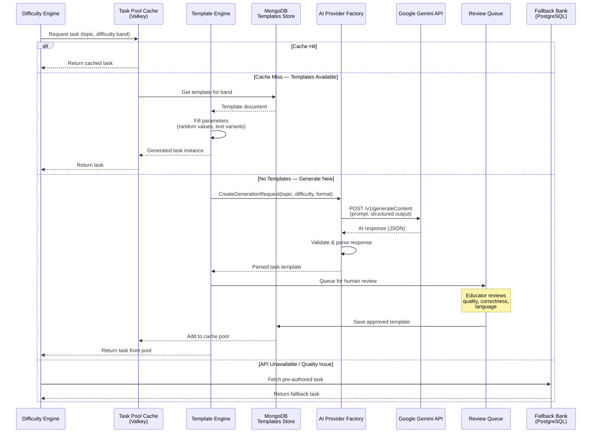

### 7.6 AI Provider Configuration — Gemini

| Aspect              | Approach                                                               |
|---------------------|------------------------------------------------------------------------|
| Provider            | Google Gemini API (primary via `IAIProviderFactory`)                    |
| Model               | Gemini 2.0 Flash or Gemini 2.0 Pro (configurable per environment)      |
| Prompt template     | System prompt defines role, subject, difficulty band, language (Ukrainian), output JSON schema |
| Output format       | Structured JSON: question, options, correct answer, explanation, difficulty metadata |
| Guardrails          | JSON schema validation, content filter, difficulty range check         |
| Temperature         | 0.4 – 0.7 depending on task type (lower for math, higher for language) |
| Retry policy        | 3 retries with exponential backoff on API failure                      |
| Fallback            | Pre-authored task bank; future: add GPT/Claude providers via factory   |
| Cost control        | Request batching, aggressive task pool caching, rate limiting          |

### 7.7 Difficulty Bands

| Band         | Range   | Description                     | Task Pool Target |
|--------------|---------|---------------------------------|------------------|
| Beginner     | 1 – 20  | Foundational concepts           | 500+ per topic   |
| Elementary   | 21 – 40 | Basic application               | 500+ per topic   |
| Intermediate | 41 – 60 | Multi-step reasoning            | 400+ per topic   |
| Advanced     | 61 – 80 | Complex problem solving         | 300+ per topic   |
| Expert       | 81 – 100| Olympiad / NMT-level            | 200+ per topic   |

---

## 8. Database Design

### 8.1 Dual Database Strategy

Stride uses a **dual-database** approach:

| Database       | Engine         | Purpose                                                        |
|----------------|----------------|----------------------------------------------------------------|
| **PostgreSQL** | PostgreSQL 17+ | Relational data: users, profiles, gamification, classes, leaderboards, performance tracking |
| **MongoDB**    | MongoDB 7+     | Document data: AI-generated task templates, task instances, AI generation logs, flexible content |

**Rationale:** PostgreSQL handles structured relational data with strong ACID guarantees. MongoDB handles the highly variable, schema-flexible AI-generated content (task templates with different structures per task type, AI generation logs, cached task pools).

### 8.2 PostgreSQL — Relational Schema (EF Core)

```mermaid
erDiagram
    USER ||--o{ STUDENT_PROFILE : has
    USER ||--o{ TEACHER_PROFILE : has
    USER {
        uuid id PK
        string email UK
        string passwordHash
        string displayName
        string avatarUrl
        enum role
        datetime createdAt
        datetime lastLoginAt
        boolean isActive
    }

    STUDENT_PROFILE {
        uuid id PK
        uuid userId FK
        int totalXp
        int currentLevel
        int currentStreak
        int longestStreak
        int streakFreezes
        date lastActiveDate
    }

    TEACHER_PROFILE {
        uuid id PK
        uuid userId FK
        string school
        string department
    }

    SUBJECT {
        uuid id PK
        string name
        string slug
        string description
        string iconUrl
        int sortOrder
    }

    TOPIC ||--|| SUBJECT : belongsTo
    TOPIC {
        uuid id PK
        uuid subjectId FK
        uuid parentTopicId FK
        string name
        string slug
        int gradeLevel
        int sortOrder
    }

    LEARNING_PATH ||--|{ LEARNING_PATH_STEP : contains
    LEARNING_PATH {
        uuid id PK
        uuid subjectId FK
        string name
        int gradeLevel
        string description
    }

    LEARNING_PATH_STEP {
        uuid id PK
        uuid learningPathId FK
        uuid topicId FK
        int stepOrder
    }

    STUDENT_PERFORMANCE ||--|| TOPIC : tracks
    STUDENT_PERFORMANCE ||--|| STUDENT_PROFILE : belongsTo
    STUDENT_PERFORMANCE {
        uuid id PK
        uuid studentId FK
        uuid topicId FK
        float currentDifficulty
        float rollingAccuracy
        int currentStreak
        enum streakDirection
        float topicMastery
        int totalAttempted
        datetime lastActiveAt
    }

    TASK_ATTEMPT ||--|| STUDENT_PROFILE : belongsTo
    TASK_ATTEMPT {
        uuid id PK
        uuid studentId FK
        string taskInstanceId
        uuid topicId FK
        boolean isCorrect
        int responseTimeMs
        float difficultyAtTime
        datetime attemptedAt
    }

    ACHIEVEMENT {
        uuid id PK
        string code UK
        string name
        string description
        string iconUrl
    }

    STUDENT_ACHIEVEMENT ||--|| ACHIEVEMENT : unlocks
    STUDENT_ACHIEVEMENT ||--|| STUDENT_PROFILE : belongsTo
    STUDENT_ACHIEVEMENT {
        uuid id PK
        uuid studentId FK
        uuid achievementId FK
        datetime unlockedAt
    }

    LEADERBOARD_ENTRY {
        uuid id PK
        uuid studentId FK
        enum league
        int weekNumber
        int year
        int weeklyXp
        int rank
    }

    CLASS ||--|| TEACHER_PROFILE : managedBy
    CLASS ||--|{ CLASS_MEMBERSHIP : has
    CLASS {
        uuid id PK
        uuid teacherId FK
        string name
        string joinCode UK
        int gradeLevel
    }

    CLASS_MEMBERSHIP {
        uuid id PK
        uuid classId FK
        uuid studentId FK
        datetime joinedAt
    }

    CLASS_ASSIGNMENT ||--|| CLASS : assignedTo
    CLASS_ASSIGNMENT ||--|| TOPIC : targets
    CLASS_ASSIGNMENT {
        uuid id PK
        uuid classId FK
        uuid topicId FK
        uuid teacherId FK
        datetime dueDate
        int taskCount
        int minDifficulty
        int maxDifficulty
    }
```

### 8.3 MongoDB — Document Collections

#### `task_templates` Collection

```json
{
  "_id": "ObjectId",
  "topicId": "uuid",
  "taskType": "multiple_choice | fill_blank | matching | ordering | short_answer | drag_drop | true_false",
  "difficultyBandMin": 1,
  "difficultyBandMax": 20,
  "templateContent": {
    "questionTemplate": "Яке значення виразу {{a}} + {{b}}?",
    "parameters": {
      "a": { "type": "int", "min": 1, "max": 50 },
      "b": { "type": "int", "min": 1, "max": 50 }
    },
    "optionsTemplate": ["{{a+b}}", "{{a+b+1}}", "{{a+b-1}}", "{{a*b}}"],
    "correctAnswerTemplate": "{{a+b}}",
    "explanationTemplate": "{{a}} + {{b}} = {{a+b}}"
  },
  "isAIGenerated": true,
  "isApproved": true,
  "aiProvider": "gemini",
  "aiModel": "gemini-2.0-flash",
  "createdAt": "ISODate",
  "reviewedBy": "uuid",
  "reviewedAt": "ISODate",
  "tags": ["arithmetic", "addition"]
}
```

#### `task_instances` Collection

```json
{
  "_id": "ObjectId",
  "templateId": "ObjectId",
  "topicId": "uuid",
  "difficulty": 15.5,
  "renderedContent": {
    "question": "Яке значення виразу 23 + 17?",
    "options": ["40", "41", "39", "391"],
    "correctAnswer": "40",
    "explanation": "23 + 17 = 40"
  },
  "taskType": "multiple_choice",
  "generatedAt": "ISODate",
  "usageCount": 0
}
```

#### `ai_generation_logs` Collection

```json
{
  "_id": "ObjectId",
  "provider": "gemini",
  "model": "gemini-2.0-flash",
  "prompt": "...",
  "response": "...",
  "tokensUsed": { "input": 450, "output": 320 },
  "latencyMs": 1200,
  "success": true,
  "errorMessage": null,
  "createdAt": "ISODate"
}
```

### 8.4 PostgreSQL Indexing Strategy

| Table                  | Index                                        | Type       | Purpose                              |
|------------------------|----------------------------------------------|------------|--------------------------------------|
| `task_attempt`         | `(student_id, topic_id, attempted_at DESC)`  | B-tree     | Performance history queries          |
| `task_attempt`         | `(student_id, attempted_at DESC)`            | B-tree     | Recent activity feed                 |
| `student_performance`  | `(student_id, topic_id)` UNIQUE              | B-tree     | Performance model lookups            |
| `leaderboard_entry`    | `(league, week_number, year, weekly_xp DESC)`| B-tree     | Leaderboard ranking                  |
| `user`                 | `(email)` UNIQUE                             | B-tree     | Authentication                       |
| `class`                | `(join_code)` UNIQUE                         | B-tree     | Class join by code                   |

### 8.5 MongoDB Indexing Strategy

| Collection         | Index                                            | Purpose                              |
|--------------------|--------------------------------------------------|--------------------------------------|
| `task_templates`   | `{ topicId: 1, difficultyBandMin: 1, isApproved: 1 }` | Task pool lookups            |
| `task_templates`   | `{ isApproved: 1, createdAt: -1 }`              | Review queue                         |
| `task_instances`   | `{ topicId: 1, difficulty: 1 }`                  | Task selection by difficulty band    |
| `task_instances`   | `{ templateId: 1 }`                              | Template → instance lookups          |
| `ai_generation_logs` | `{ createdAt: -1 }`                            | Recent log browsing                  |

### 8.6 Data Partitioning (Scale Phase)

| Table/Collection   | Partition Strategy           | Key                    |
|--------------------|------------------------------|------------------------|
| `task_attempt`     | Range by `attempted_at`      | Monthly partitions     |
| `leaderboard_entry`| Range by `year, week_number` | Weekly partitions      |

---

## 9. Authentication & Authorization

### 9.1 Architecture

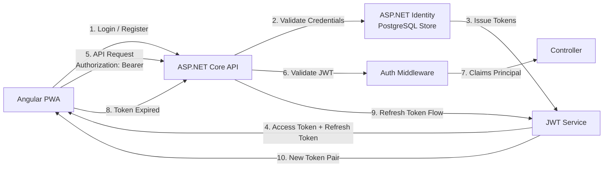

### 9.2 Authentication Providers

| Provider        | Method                           | Implementation                    |
|-----------------|----------------------------------|-----------------------------------|
| Email/Password  | ASP.NET Identity                 | Built-in with bcrypt hashing      |
| Google OAuth    | External OAuth 2.0 / OIDC       | `AddGoogle()` auth extension      |

> **Note:** Only email/password registration and Google OAuth are supported for MVP. Additional providers (Apple, Facebook, etc.) may be added in future phases.

### 9.3 Auth Flow — Registration

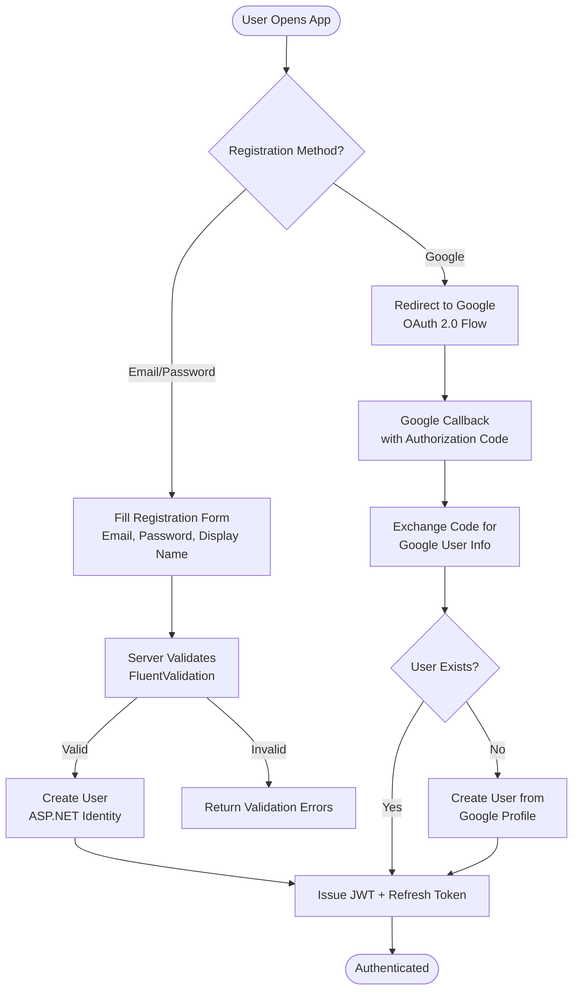

### 9.4 Token Strategy

| Token          | Lifetime  | Storage (Client)         | Rotation        |
|----------------|-----------|--------------------------|-----------------|
| Access Token   | 15 min    | Memory (JS variable)     | On refresh      |
| Refresh Token  | 30 days   | HttpOnly Secure Cookie   | Rotate on use   |

### 9.5 Role-Based Authorization

| Role      | Capabilities                                                                 |
|-----------|------------------------------------------------------------------------------|
| Student   | Take tasks, view own stats, join classes, view leaderboards                  |
| Teacher   | All Student + create classes, assign tasks, view class analytics             |
| Admin     | All Teacher + manage users, manage content, monitor AI, system configuration |

Policy-based authorization with `[Authorize(Policy = "...")]` attributes:

```
Policies:
  StudentAccess  → Role == Student | Teacher | Admin
  TeacherAccess  → Role == Teacher | Admin
  AdminAccess    → Role == Admin
  ClassOwner     → Teacher + owns the class resource
  SelfOnly       → UserId matches resource owner
```

---

## 10. Gamification Engine

### 10.1 XP System

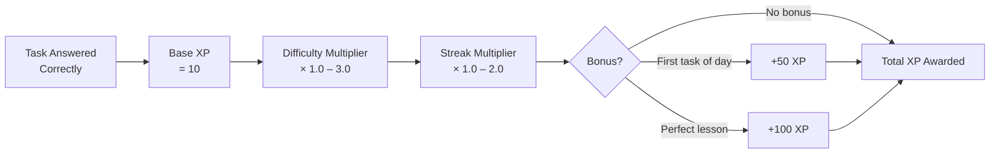

| XP Factor              | Formula                                                  |
|------------------------|----------------------------------------------------------|
| Base XP                | 10 per correct answer                                    |
| Difficulty multiplier  | `1.0 + (difficulty / 50.0)` → range 1.0 – 3.0           |
| Streak multiplier      | `1.0 + min(streak, 10) * 0.1` → range 1.0 – 2.0        |
| First task of day      | +50 bonus XP                                             |
| Perfect lesson (100%)  | +100 bonus XP                                            |
| Wrong answer           | 0 XP (no penalty)                                        |

### 10.2 Level Progression

| Level Range | XP per Level | Cumulative XP (approx) |
|-------------|-------------|------------------------|
| 1 – 10      | 100         | 1,000                  |
| 11 – 25     | 250         | 4,750                  |
| 26 – 50     | 500         | 17,250                 |
| 51 – 100    | 1,000       | 67,250                 |
| 100+        | 2,000       | ∞                      |

### 10.3 Streak System

| Mechanic         | Rule                                                               |
|------------------|--------------------------------------------------------------------|
| Earn streak      | Complete ≥ 1 task per calendar day (user's timezone)               |
| Break streak     | Miss an entire calendar day                                        |
| Streak freeze    | Protects streak for 1 day; costs 200 XP to purchase; max 2 held   |
| Streak repair    | Restore streak within 24 hours of break; costs 400 XP             |

### 10.4 League / Leaderboard System

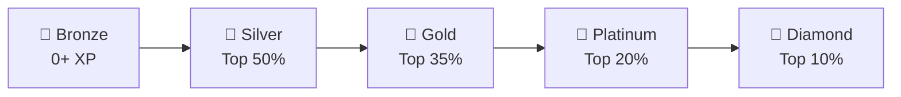

| Rule               | Detail                                                          |
|--------------------|-----------------------------------------------------------------|
| Cycle              | Weekly (Monday 00:00 UTC – Sunday 23:59 UTC)                    |
| Promotion          | Top 10 in league → promoted to next league                      |
| Demotion           | Bottom 5 in league → demoted to previous league                 |
| Safe zone          | Middle → stay in same league                                    |
| Group size         | 30 users per leaderboard group                                  |
| Stored in          | Valkey sorted set (real-time) + PostgreSQL (historical)         |

---

## 11. Real-Time Communication

### 11.1 SignalR Hub Architecture

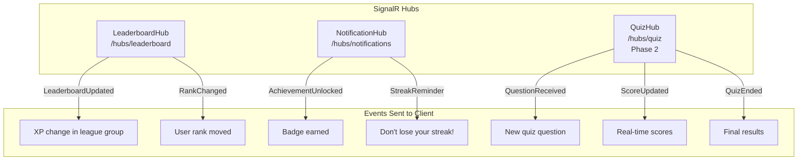

### 11.2 Transport Fallback

| Priority | Transport          | Use Case                        |
|----------|--------------------|---------------------------------|
| 1        | WebSockets         | Primary — lowest latency        |
| 2        | Server-Sent Events | Fallback if WS blocked          |
| 3        | Long Polling       | Last resort (corporate proxies) |

---

## 12. Caching Strategy

### 12.1 Valkey Cache Layer

| Cache Key Pattern                         | TTL      | Purpose                                              |
|-------------------------------------------|----------|------------------------------------------------------|
| `leaderboard:{league}:{week}`             | Real-time| Sorted set for live leaderboard                      |
| `taskpool:{topicId}:{band}`               | 1 hour   | Pre-generated task instances per difficulty band      |
| `student:perf:{studentId}:{topicId}`      | 10 min   | Hot student performance model                        |
| `session:{userId}`                        | 30 min   | Active user session metadata                         |
| `streak:{userId}`                         | 24 hours | Current streak state                                 |
| `ratelimit:{userId}:{endpoint}`           | Variable | API rate limiting counters                           |

### 12.2 Cache Invalidation

| Trigger                         | Action                                             |
|---------------------------------|----------------------------------------------------|
| Task answered                   | Invalidate `student:perf:*` for that student/topic |
| Task pool depleted below N      | Background job refills pool via AI pipeline        |
| Leaderboard XP change           | `ZINCRBY` on sorted set (atomic, no invalidation)  |
| Content updated by admin        | Invalidate related `taskpool:*` keys               |

---

## 13. Search Infrastructure

### 13.1 Meilisearch Configuration

| Index             | Searchable Attributes                     | Filterable       | Sortable       |
|-------------------|-------------------------------------------|------------------|----------------|
| `subjects`        | `name`, `description`                     | `gradeLevel`     | `sortOrder`    |
| `topics`          | `name`, `description`, `tags`             | `subjectId`, `gradeLevel` | `sortOrder` |
| `task_templates`  | `content`, `tags`                         | `topicId`, `difficulty`, `taskType`, `isApproved` | `createdAt` |

### 13.2 Sync Strategy

- EF Core save interceptor triggers sync for PostgreSQL entities
- MongoDB change stream listener triggers sync for document entities
- Full re-index available via admin command

---

## 14. File Storage

### 14.1 MinIO Object Storage

| Bucket              | Content Type                        | Access          |
|---------------------|-------------------------------------|-----------------|
| `avatars`           | User profile images                 | Public read     |
| `assets`            | Subject/topic icons, badge images   | Public read     |
| `uploads`           | Teacher-uploaded materials (Phase 3)| Authenticated   |
| `exports`           | Generated reports, certificates     | Authenticated   |

### 14.2 Upload Flow

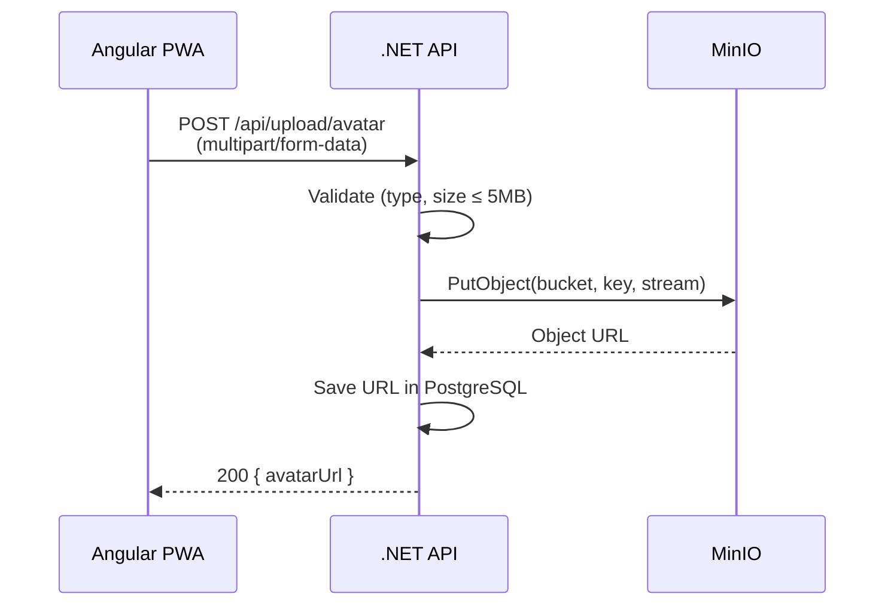

---

## 15. API Design

### 15.1 API Conventions

| Convention            | Standard                                    |
|-----------------------|---------------------------------------------|
| Style                 | RESTful                                     |
| Format                | JSON (camelCase)                            |
| Versioning            | URL path (`/api/v1/...`)                    |
| Pagination            | Cursor-based (default) or offset            |
| Error format          | RFC 7807 Problem Details                    |
| Rate limiting         | Token bucket per user, stricter for AI endpoints |
| Documentation         | OpenAPI 3.1 via Swashbuckle / NSwag         |

### 15.2 Core API Endpoints

#### Identity

| Method | Endpoint                        | Description                      |
|--------|---------------------------------|----------------------------------|
| POST   | `/api/v1/auth/register`         | Register new account (email/password) |
| POST   | `/api/v1/auth/login`            | Login (email/password)           |
| POST   | `/api/v1/auth/google`           | Google OAuth login/register      |
| POST   | `/api/v1/auth/refresh`          | Refresh token pair               |
| POST   | `/api/v1/auth/logout`           | Revoke refresh token             |
| GET    | `/api/v1/users/me`              | Get current user profile         |
| PUT    | `/api/v1/users/me`              | Update profile                   |

#### Learning

| Method | Endpoint                              | Description                          |
|--------|---------------------------------------|--------------------------------------|
| GET    | `/api/v1/subjects`                    | List all subjects                    |
| GET    | `/api/v1/subjects/{id}/topics`        | List topics for a subject            |
| GET    | `/api/v1/topics/{id}`                 | Get topic details + progress         |
| GET    | `/api/v1/learning-paths`              | List available learning paths        |
| GET    | `/api/v1/learning-paths/{id}`         | Get path steps + completion status   |

#### Tasks (Adaptive AI)

| Method | Endpoint                              | Description                            |
|--------|---------------------------------------|----------------------------------------|
| GET    | `/api/v1/tasks/next?topicId={id}`     | Get next adaptive task for student     |
| POST   | `/api/v1/tasks/{id}/submit`           | Submit answer, receive evaluation      |
| GET    | `/api/v1/tasks/history?topicId={id}`  | Get task attempt history               |

#### Gamification

| Method | Endpoint                              | Description                          |
|--------|---------------------------------------|--------------------------------------|
| GET    | `/api/v1/gamification/stats`          | Get user's XP, level, streak         |
| GET    | `/api/v1/gamification/achievements`   | List achievements (earned + locked)  |
| GET    | `/api/v1/leaderboard?league={league}` | Get current week's leaderboard       |
| POST   | `/api/v1/gamification/streak/freeze`  | Purchase streak freeze               |
| POST   | `/api/v1/gamification/streak/repair`  | Repair broken streak                 |

#### Teacher

| Method | Endpoint                                      | Description                      |
|--------|-----------------------------------------------|----------------------------------|
| POST   | `/api/v1/classes`                              | Create a class                   |
| GET    | `/api/v1/classes`                              | List teacher's classes           |
| GET    | `/api/v1/classes/{id}/students`                | List students in class           |
| GET    | `/api/v1/classes/{id}/analytics`               | Class performance analytics      |
| POST   | `/api/v1/classes/{id}/assignments`             | Create task assignment           |
| POST   | `/api/v1/classes/join`                         | Student joins class (by code)    |

#### Admin

| Method | Endpoint                                      | Description                      |
|--------|-----------------------------------------------|----------------------------------|
| GET    | `/api/v1/admin/users`                          | List/search users                |
| PUT    | `/api/v1/admin/users/{id}/role`                | Update user role                 |
| GET    | `/api/v1/admin/ai/review-queue`                | View AI-generated tasks for review |
| POST   | `/api/v1/admin/ai/review-queue/{id}/approve`   | Approve AI task template         |
| POST   | `/api/v1/admin/ai/review-queue/{id}/reject`    | Reject AI task template          |
| GET    | `/api/v1/admin/analytics/dashboard`            | System-wide analytics            |

### 15.3 Standard Error Response (RFC 7807)

```json
{
  "type": "https://stride.ua/errors/validation",
  "title": "Validation Error",
  "status": 400,
  "detail": "One or more validation errors occurred.",
  "instance": "/api/v1/tasks/abc123/submit",
  "errors": {
    "answer": ["Answer field is required."]
  },
  "traceId": "00-abc123def456-789ghi-01"
}
```

---

## 16. CI/CD Pipeline

### 16.1 Pipeline Architecture

```mermaid
flowchart LR
    subgraph Trigger
        PR[Pull Request] --> CI
        MERGE[Merge to main] --> CD
    end

    subgraph CI — Continuous Integration
        CI[GitHub Actions<br/>CI Workflow]
        CI --> LINT[Lint & Format<br/>dotnet format<br/>ng lint]
        LINT --> BUILD[Build<br/>.NET + Angular]
        BUILD --> TEST_U[Unit Tests<br/>xUnit + Jest]
        TEST_U --> TEST_I[Integration Tests<br/>Testcontainers<br/>PostgreSQL + MongoDB + Valkey]
        TEST_I --> SCAN[Security Scan<br/>dotnet audit<br/>npm audit]
        SCAN --> REPORT[Coverage Report<br/>Codecov]
    end

    subgraph CD — Continuous Deployment
        CD[GitHub Actions<br/>CD Workflow]
        CD --> DOCKER[Docker Build<br/>Multi-stage]
        DOCKER --> PUSH[Push to<br/>Container Registry]
        PUSH --> DEPLOY[Deploy via<br/>Docker Compose<br/>Rolling Update]
        DEPLOY --> SMOKE[Smoke Tests<br/>Health Checks]
        SMOKE -->|Fail| ROLLBACK[Auto-Rollback<br/>Previous Image]
    end
```

### 16.2 Branch Strategy

| Branch        | Purpose                   | Deploy Target | Auto-Deploy |
|---------------|---------------------------|---------------|-------------|
| `main`        | Production-ready code     | Production    | Yes         |
| `develop`     | Integration branch        | Staging       | Yes         |
| `feature/*`   | Feature development       | —             | CI only     |
| `hotfix/*`    | Critical production fixes | Production    | Manual      |

### 16.3 Quality Gates

| Gate            | Threshold           | Enforced On   |
|-----------------|----------------------|---------------|
| Unit test pass  | 100% pass            | All PRs       |
| Code coverage   | ≥ 80% line coverage  | All PRs       |
| Lint pass       | Zero errors          | All PRs       |
| Security audit  | No critical CVEs     | All PRs       |
| Integration test| 100% pass            | merge to main |

---

## 17. Infrastructure & Deployment

### 17.1 Deployment Architecture — Docker Compose

All environments (development, staging, production) run exclusively on **Docker Compose**.

```mermaid
graph TB
    subgraph Internet
        USER[End Users<br/>Browser / PWA]
        CDN[CDN<br/>Cloudflare]
    end

    subgraph Hetzner VPS — Docker Compose
        NGINX_PROXY[NGINX<br/>Reverse Proxy<br/>TLS Termination]
        
        subgraph Application
            API_1[Stride API<br/>Instance 1]
            API_2[Stride API<br/>Instance 2]
        end

        subgraph Data Stores
            PG_PRIMARY[(PostgreSQL 17)]
            MONGO_DB[(MongoDB 7)]
            VALKEY_CACHE[(Valkey<br/>Cache)]
        end

        subgraph Support Services
            MINIO_SVC[(MinIO<br/>Object Storage)]
            MEILI_SVC[(Meilisearch<br/>Search)]
        end
    end

    USER --> CDN
    CDN --> NGINX_PROXY
    NGINX_PROXY --> API_1
    NGINX_PROXY --> API_2
    API_1 --> PG_PRIMARY
    API_2 --> PG_PRIMARY
    API_1 --> MONGO_DB
    API_2 --> MONGO_DB
    API_1 --> VALKEY_CACHE
    API_2 --> VALKEY_CACHE
    API_1 --> MINIO_SVC
    API_1 --> MEILI_SVC
    API_1 -.->|HTTPS| GEMINI_EXT[Google Gemini API<br/>External]
    API_2 -.->|HTTPS| GEMINI_EXT
```

### 17.2 Docker Compose Services

| Service       | Image                        | Ports       | Volumes                  | Resources        |
|---------------|------------------------------|-------------|--------------------------|------------------|
| `nginx`       | `nginx:alpine`               | 80, 443     | certs, config            | 256 MB RAM       |
| `api`         | `stride-api:latest`          | 5000 (int)  | —                        | 1 GB RAM         |
| `postgres`    | `postgres:17-alpine`         | 5432 (int)  | pgdata                   | 2 GB RAM         |
| `mongodb`     | `mongo:7`                    | 27017 (int) | mongodata                | 1 GB RAM         |
| `valkey`      | `valkey/valkey:8-alpine`     | 6379 (int)  | valkeydata               | 512 MB RAM       |
| `minio`       | `minio/minio`                | 9000 (int)  | miniodata                | 512 MB RAM       |
| `meilisearch` | `getmeili/meilisearch`       | 7700 (int)  | meilidata                | 512 MB RAM       |

### 17.3 Minimum Server Requirements

| Environment | CPU      | RAM     | Storage   | Estimated Cost     |
|-------------|----------|---------|-----------|---------------------|
| Development | 4 cores  | 16 GB   | 100 GB SSD| Local machine       |
| Staging     | 4 cores  | 8 GB    | 80 GB SSD | ~€15/mo (Hetzner)  |
| Production  | 8 cores  | 16 GB   | 250 GB SSD| ~€40/mo (Hetzner)  |

> **Note:** No GPU required — AI generation uses Google Gemini API (external), not self-hosted models.

### 17.4 Backup Strategy

| Data            | Method                  | Frequency | Retention   |
|-----------------|-------------------------|-----------|-------------|
| PostgreSQL      | `pg_dump` + WAL archival| Daily full + continuous WAL | 30 days |
| MongoDB         | `mongodump`             | Daily     | 30 days     |
| Valkey          | RDB snapshots           | Every 6 hours | 7 days    |
| MinIO           | Bucket versioning + rsync| Daily    | 30 days     |
| Configuration   | Git-tracked (IaC)       | Every commit | Permanent  |

### 17.5 Deployment Process

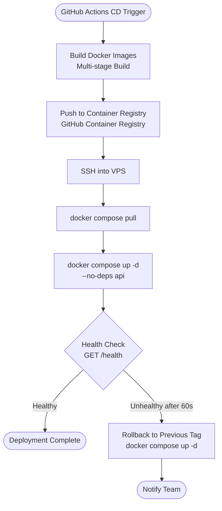

---

## 18. Security Architecture

### 18.1 Security Layers

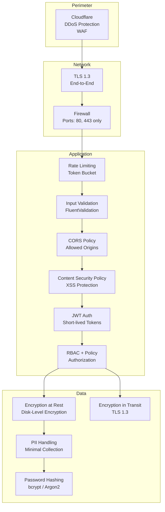

### 18.2 OWASP Top 10 Mitigation

| Risk                        | Mitigation                                                      |
|-----------------------------|-----------------------------------------------------------------|
| A01 Broken Access Control   | RBAC policies, resource ownership checks, CORS                  |
| A02 Cryptographic Failures  | TLS 1.3, bcrypt/Argon2 for passwords, disk encryption at rest   |
| A03 Injection               | EF Core parameterized queries, MongoDB driver sanitization, FluentValidation |
| A04 Insecure Design         | Threat modeling, layered architecture separation                 |
| A05 Security Misconfiguration| Hardened Docker images, no default credentials, env-specific config |
| A06 Vulnerable Components   | `dotnet audit`, `npm audit` in CI, Dependabot                   |
| A07 Authentication Failures | Short JWT TTL, refresh token rotation, account lockout           |
| A08 Data Integrity Failures | Signed JWTs, integrity checks on AI-generated content            |
| A09 Logging Failures        | Structured logging (Serilog to console/file), audit trail for admin actions |
| A10 SSRF                    | No user-supplied URLs in server requests; Gemini API calls use fixed endpoint |

### 18.3 Data Privacy (GDPR / Ukrainian Law)

| Principle              | Implementation                                                  |
|------------------------|-----------------------------------------------------------------|
| Data minimization      | Collect only necessary PII (email, name, avatar)                |
| Right to access        | `/api/v1/users/me/data-export` endpoint (JSON download)        |
| Right to erasure       | `/api/v1/users/me/delete` — full account deletion with cascade  |
| Data residency         | All data stored in EU (Hetzner Germany) or Ukraine              |
| Consent                | Explicit consent at registration; cookie banner for analytics   |
| Breach notification    | 72-hour notification process                                    |

---

## 19. Performance & Scalability

### 19.1 Performance Targets (per NFRs)

| Metric                           | Target      | Measurement              |
|----------------------------------|-------------|--------------------------|
| API p95 latency                  | ≤ 200 ms    | Application logging      |
| Task delivery (cached)           | ≤ 50 ms     | Application logging      |
| Task generation (Gemini API)     | ≤ 3 s       | AI generation logs       |
| Leaderboard query                | ≤ 30 ms     | Valkey sorted set        |
| Page load (LCP)                  | ≤ 2 s       | Lighthouse               |
| Time to Interactive              | ≤ 3 s       | Lighthouse               |
| Concurrent users (MVP)           | 5,000       | k6 load test             |

### 19.2 Scalability Path

```mermaid
graph LR
    subgraph Phase 1 — MVP
        MONO[Layered Monolith<br/>2 API Instances<br/>Docker Compose]
    end

    subgraph Phase 2 — Growth
        SCALE[Scale Horizontally<br/>4+ API Instances<br/>PG Read Replica<br/>MongoDB Replica Set<br/>Docker Compose]
    end

    MONO -->|5K concurrent| SCALE
```

### 19.3 Optimization Strategies

| Strategy                       | Target Component     | Approach                                        |
|--------------------------------|----------------------|-------------------------------------------------|
| Task pool pre-warming          | AI Pipeline          | Background job keeps pool filled per band       |
| Response caching               | API                  | Valkey output cache for leaderboards, catalogs  |
| Connection pooling             | PostgreSQL           | Npgsql pool (min: 10, max: 100)                 |
| Compiled queries               | EF Core              | `EF.CompileAsyncQuery` for hot paths            |
| Read replicas (Phase 2)        | PostgreSQL           | Read-heavy queries routed to replica            |
| CDN for static assets          | Frontend             | Cloudflare CDN for PWA shell + assets           |
| Lazy loading modules           | Angular              | Feature modules loaded on demand                |
| Image optimization             | Storage              | WebP conversion, responsive `srcset`            |
| Database indexing              | PostgreSQL + MongoDB | Targeted indexes (see Sections 8.4, 8.5)       |
| Gemini API batching            | AI Service           | Batch multiple template requests per API call   |

---

## 20. Testing Strategy

### 20.1 Test Pyramid

```mermaid
graph TB
    subgraph Test Pyramid
        E2E[E2E Tests<br/>Playwright<br/>~20 critical paths]
        INT[Integration Tests<br/>Testcontainers, WebApplicationFactory<br/>~200 tests]
        UNIT[Unit Tests<br/>xUnit, Jest<br/>~1000+ tests]
    end

    E2E ---|Fewer, slower, more coverage per test| INT
    INT ---|More tests, faster, focused| UNIT

    style UNIT fill:#4CAF50,color:#fff
    style INT fill:#FF9800,color:#fff
    style E2E fill:#F44336,color:#fff
```

### 20.2 Test Matrix

| Layer              | Framework        | Scope                                           | Run Frequency |
|--------------------|------------------|--------------------------------------------------|---------------|
| Unit — .NET        | xUnit + Moq      | Service logic, difficulty algorithm, validators  | Every commit  |
| Unit — Angular     | Jest              | Components, services, pipes                      | Every commit  |
| Integration — API  | WebApplicationFactory + Testcontainers | Full API endpoints with real PG/Mongo/Valkey | Every PR |
| Integration — AI   | Custom harness    | AI pipeline end-to-end: prompt → task → validation | Nightly     |
| Load                | k6               | 5K concurrent users simulation                    | Weekly        |
| E2E                | Playwright        | Critical user journeys (register, learn, streak)  | Nightly       |
| AI Quality         | Custom validators | Correctness, difficulty accuracy, Ukrainian language quality | Every AI batch |
| Manual QA          | Educator review   | AI-generated content sampling                     | Weekly        |

### 20.3 Key Test Scenarios — Adaptive AI

| Scenario                                     | Validation                                             |
|----------------------------------------------|--------------------------------------------------------|
| 10 correct in a row                          | Difficulty increases steadily; stays ≤ 100             |
| 5 wrong in a row                             | Difficulty decreases; stays ≥ 1                        |
| Mix of correct/incorrect                     | Difficulty oscillates around flow zone (70–80%)        |
| 30-day absence then return                   | Difficulty regressed ~20% from last value              |
| New student, first session                   | Starts at difficulty 25 (beginner+)                    |
| Task pool cache miss                         | Falls back to template generation or fallback bank     |
| Gemini API returns malformed response        | Retries; ultimately falls back to pre-authored tasks   |
| Student switches topics                      | Each topic has independent difficulty                  |
| AI provider factory returns correct provider | Factory resolves Gemini by default; extensible         |

---

## 21. Internationalization (i18n)

### 21.1 Architecture

| Layer     | Tool                         | Strategy                                          |
|-----------|------------------------------|---------------------------------------------------|
| Frontend  | `@angular/localize` or `ngx-translate` | JSON translation files per locale         |
| Backend   | Resource files (`.resx`)     | Error messages, notifications, email templates     |
| Content   | PostgreSQL / MongoDB `locale` field | Task content stored per language             |
| Dates     | UTC storage + user timezone  | Client-side formatting via locale                  |
| Numbers   | ICU message format           | Pluralization rules per language                   |

### 21.2 Supported Locales

| Phase | Locale  | Language         |
|-------|---------|------------------|
| MVP   | `uk-UA` | Ukrainian        |
| 2     | `en-US` | English          |
| 3+    | `pl-PL` | Polish           |
| 3+    | `de-DE` | German           |

---

## 22. Phased Delivery Roadmap

```mermaid
gantt
    title Stride Development Roadmap
    dateFormat  YYYY-MM
    axisFormat  %Y-%m

    section Phase 1 — MVP
    Architecture & Setup           :p1a, 2026-02, 1M
    Identity & Auth                :p1b, after p1a, 1M
    Learning Module & Content      :p1c, after p1a, 2M
    Adaptive AI Service            :p1d, after p1a, 3M
    Gamification Engine            :p1e, after p1b, 2M
    Angular PWA Frontend           :p1f, after p1a, 3M
    Teacher Dashboard              :p1g, after p1c, 1M
    Admin Panel                    :p1h, after p1c, 1M
    Testing & QA                   :p1i, after p1d, 1M
    MVP Launch                     :milestone, 2026-08, 0d

    section Phase 2 — Engagement
    Hearts/Lives System            :p2a, 2026-08, 1M
    Daily/Weekly Challenges        :p2b, 2026-08, 1M
    Multiplayer Quiz (SignalR)     :p2c, 2026-09, 2M
    Avatar Customization           :p2d, 2026-09, 1M

    section Phase 3 — Advanced AI
    AI Tutor Chatbot               :p3a, 2026-11, 2M
    PDF/Notes Upload → AI Study    :p3b, 2026-11, 2M
    AI Study Plans                 :p3c, 2027-01, 1M
    Add GPT/Claude Providers       :p3d, 2027-01, 1M

    section Phase 4 — Social
    Friend System                  :p4a, 2027-02, 1M
    Study Groups                   :p4b, 2027-02, 1M
    Parent Dashboard               :p4c, 2027-03, 1M

    section Phase 5 — Expansion
    New Subjects (5+)              :p5a, 2027-04, 3M
    University Content             :p5b, 2027-04, 3M

    section Phase 6 — Platform
    Native Mobile Apps             :p6a, 2027-07, 4M
    Freemium & B2B                 :p6b, 2027-07, 2M
    Certificates                   :p6c, 2027-09, 1M
```

---

## 23. Appendix — Technology Matrix

| Category          | Technology                   | Version | License       | Purpose                           |
|-------------------|------------------------------|---------|---------------|-----------------------------------|
| Backend Framework | ASP.NET Core                 | 10.0    | MIT           | Web API, SignalR, Hosting         |
| ORM               | Entity Framework Core        | 10.0    | MIT           | PostgreSQL data access            |
| MongoDB Driver    | MongoDB.Driver               | 3.x     | Apache 2.0    | MongoDB data access               |
| Validation        | FluentValidation             | 11+     | Apache 2.0    | Input validation                  |
| Mapping           | Mapster                      | 7+      | MIT           | DTO mapping                       |
| Frontend          | Angular                      | 20      | MIT           | SPA framework                     |
| UI Framework      | Tailwind CSS                 | 4+      | MIT           | Utility-first styling             |
| State             | Angular Signals              | 20+     | MIT           | Client-side state management      |
| Relational DB     | PostgreSQL                   | 17+     | PostgreSQL    | Relational data store             |
| Document DB       | MongoDB                      | 7+      | SSPL          | Document store (AI tasks, templates) |
| Cache             | Valkey                       | 8+      | BSD-3         | Caching, leaderboards             |
| Search            | Meilisearch                  | 1.x     | MIT           | Full-text search                  |
| Object Storage    | MinIO                        | Latest  | AGPL-3.0      | File/blob storage                 |
| AI API (Primary)  | Google Gemini API            | v1      | Proprietary   | Task generation (primary provider) |
| AI API (Future)   | OpenAI API / Claude API      | —       | Proprietary   | Task generation (future providers) |
| Logging           | Serilog (console + file)     | Latest  | Apache 2.0    | Application logging               |
| Testing (.NET)    | xUnit + Moq                  | Latest  | Apache/BSD    | Unit & integration tests          |
| Testing (Angular) | Jest                         | Latest  | MIT           | Component & service tests         |
| Testing (E2E)     | Playwright                   | Latest  | Apache 2.0    | End-to-end browser tests          |
| Load Testing      | k6                           | Latest  | AGPL-3.0      | Performance testing               |
| CI/CD             | GitHub Actions               | N/A     | Free tier     | Pipeline automation               |
| Containerization  | Docker + Docker Compose      | Latest  | Apache 2.0    | Development & deployment          |
| Reverse Proxy     | NGINX                        | Latest  | BSD-2         | TLS, routing, load balancing      |
| CDN / WAF         | Cloudflare                   | Free    | Proprietary   | DDoS protection, CDN              |

---

## 24. Appendix — Glossary

| Term                    | Definition                                                                 |
|-------------------------|---------------------------------------------------------------------------|
| **Adaptive AI Service** | Stride's proprietary engine for task generation and difficulty calibration |
| **AI Provider Factory** | Factory pattern that creates the appropriate AI provider (Gemini, GPT, Claude) |
| **Difficulty Level**    | A real-time score (1–100) per student per topic                           |
| **Difficulty Band**     | A range grouping (e.g., Beginner 1–20) used for task pool bucketing       |
| **Flow Zone**           | The 70–80% success rate target that keeps students engaged                |
| **Gemini API**          | Google's generative AI API used as the primary task generation provider    |
| **NMT**                 | Національний мультипредметний тест — Ukrainian national exam              |
| **Task Template**       | A parameterized template (stored in MongoDB) from which task instances are generated |
| **Task Instance**       | A concrete task (stored in MongoDB) rendered from a template with specific values |
| **Task Pool**           | A cached set (in Valkey) of pre-generated task instances per topic and difficulty band |
| **Student Model**       | The per-student-per-topic performance vector                              |
| **Streak**              | Consecutive days of completing at least one task                          |
| **Streak Freeze**       | A consumable item that prevents streak loss for one day                   |
| **XP**                  | Experience points — the core currency earned by correct answers           |
| **League**              | A tiered leaderboard group (Bronze → Diamond)                             |
| **PWA**                 | Progressive Web App — installable web app with offline capabilities       |
| **Valkey**              | Open-source Redis-compatible in-memory cache                              |
| **Testcontainers**      | Library for running disposable Docker containers in tests                 |

---

> **Document Owner:** Stride Engineering Team  
> **Last Updated:** February 10, 2026  
> **Next Review:** March 10, 2026
